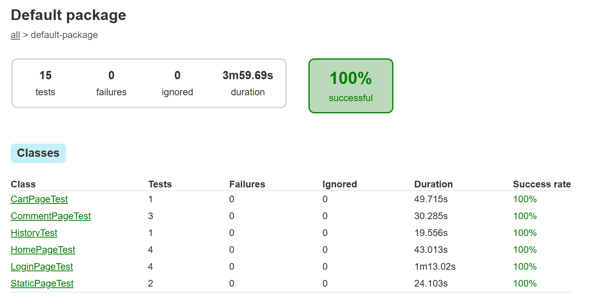

## Selenium Testing - Csapó Hunor

```
All of you have to do a big assignment that have to be presented in the future.
Our next big assignment will be a selenium test that tests a webpage that available publicly on the internet and choosen by you.
Every student has to have to choose different website.
There are many task that you can do, but there are obligatory tasks as well.
These tasks can be found in this spreadsheet.
You will need to copy this spreadsheet and fill the yelllow zones.
Watch out for the minimum requirements for grades from row 40 in the spreadsheet. For example if you do not ignore unnecessary files, you cannot get better than grade 2.
```

I updated the version of selenium to be able to do the Hover test.



I did the following tests:
						
- Fill simple form and send (eg. Login)
- Form sending with user
- Logout
- Fill input (text,radio,check...) - 6 times
- Send a form - 1 time						2
- Static Page test
- Multiple page test from array (easily extendable static page tests)
- Used complex xpath (eg. //div//a[@href='asd']) - 18 times
- Filling or reading textarea content			
- At least 8 class
- Explicit wait
- Reading the page title
- Page object pattern
- BasePage object class
- Test suite looks like readable test description							
- Points from weekly task - 2/3											
- Hover test		
- File Upload
- History test (browser back button)
- Test with random data
- Download multiple files to a folder from an user protected page			
- Readable code (Every function name describe what the function is doing)
- Structured (Organized in classes and functions)
- Unnecessary files ignored well
- Low redundancy (There are only a few of duplications of code)